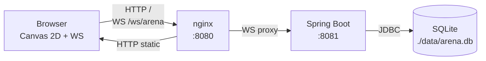

# Snake Arena

Multiplayer real-time Snake battle on a 40x30 grid via WebSocket.


## Run the demo

```bash
git clone https://github.com/Antispiner/test-agent2.git
cd test-agent2
make demo
```

`make demo` builds the server JAR, builds the frontend bundle, and starts the
full stack (nginx + Spring server + SQLite) via Docker Compose. Open
`http://localhost:8080` once the containers report healthy.

## Architecture



- **Browser** renders state on an HTML5 canvas; sends `input` frames, receives `state` frames.
- **nginx** serves the static frontend bundle and reverse-proxies `/ws/arena` to the Spring server.
- **Spring Boot** runs the 15Hz game loop, broadcasts state, persists results.
- **SQLite** holds the leaderboard (`nickname`, `total_kills`, `total_apples`, `total_wins`).

## WebSocket protocol

Full reference: [api/spec.md](./api/spec.md). Quick reference below.

### Client → Server

```json
{ "type": "join", "nick": "string" }
```

```json
{ "type": "input", "dir": "up | down | left | right" }
```

### Server → Client

```json
{ "type": "welcome", "playerId": "uuid", "tick": 0 }
```

```json
{
  "type": "state",
  "snakes": [
    { "id": "uuid", "nick": "string", "segments": [[0, 0]],
      "alive": true, "color": "#rrggbb", "kills": 0 }
  ],
  "apples": [[0, 0]],
  "tick": 0
}
```

```json
{
  "type": "round_end",
  "winner": "nick or null",
  "leaderboard": [
    { "nick": "string", "kills": 0, "length": 0 }
  ]
}
```

Coordinates: grid is `40 × 30`, `x ∈ [0, 39]`, `y ∈ [0, 29]`, origin top-left.
Tick rate: 15Hz (66ms).

## Architecture rationale

See [vault/adr/0001-snake-arena.md](./vault/adr/0001-snake-arena.md) for the
decisions behind Spring WebSocket (raw, no STOMP), Canvas 2D, SQLite via JDBC,
the 15Hz tick, and the 40x30 grid.

## Credits

Built autonomously by nerw-ecosystem agents.
